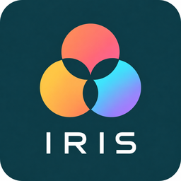

# Benni Scene Presets

A Home Assistant custom integration for **dynamic, custom light scenes** — works with
any `light` entity, no vendor bridge or account required.

The integration is the **rendering / library layer**: it stores scenes, composes them
into looks, and plays them on lights. It deliberately knows nothing about presence,
activity or day phase — that arbitration lives in an external **light policy** that
decides *which* look runs *when* (it calls `apply_look` with a look slug).

---

## Concepts

The data model has three building blocks, smallest to largest:

| Concept | What it is | Has targets? | Reusable? |
|---|---|---|---|
| **Scene (preset)** | A colour palette **or** a Kelvin (white) value list + timing. The pure "what colours/temperatures". | No | Yes |
| **Aqara preset** | A thin reference to an Aqara Advanced Lighting action (effect/scene by name). | No | Yes |
| **Look** | A named composition that **binds light sets to** scenes / Aqara presets / raw effects / off. The deployable unit. | Yes (per binding) | Yes |

The **light policy** references a **look by its slug** and applies it; everything the
user actually deploys is a look.

---

## Scenes

Create custom scenes in the panel UI. Two types:

### Colour palette
- Up to **10 colours** via colour picker (converted to CIE xy **server-side**).
- More than one colour → the scene **cycles** (dynamic loop) when applied; a single
  colour is painted once.
- Optional `shuffle` for randomised colour assignment across lights.

### White (Kelvin)
- A **list of colour temperatures** (2000–6500 K, up to 10), edited like the palette
  ("+ Add Kelvin", per-value preview).
- More than one value → the scene **sweeps** smoothly through them as a triangle wave
  (`A → B → C → B → A …`) so it eases up and down the range instead of snapping back.
- A single value is just painted once.
- Intended for white-capable lights (e.g. the ceiling lights). The target picker in a
  look only offers **white-capable** lights for a Kelvin scene.

### Common scene fields
- **Name**, optional **Category**, optional **Image** (uploaded, shown on the tile).
- **Interval (s)** — time between steps when the scene runs dynamically.
- **Transition (s)** — crossfade duration between steps / on the first paint.
- **Smooth first paint** — the first paint honours the requested `transition` for a real
  crossfade instead of snapping in.

Brightness is intentionally **not** stored on the scene — it is supplied at runtime by
the light policy / day phase.

---

## Looks

A look binds light sets to actions and is applied in one call. Each **binding** has a
type:

| Binding type | Does |
|---|---|
| **Scene** | Runs a scene (colour palette or Kelvin sweep) on its lights. |
| **Aqara preset** | Calls the referenced Aqara Advanced Lighting action on its lights. |
| **Effect (raw)** | Advanced/fallback: calls an arbitrary `domain.service` with data. |
| **Off** | Turns its lights **off** when the look is applied (any vendor). |

Look-level options:
- **Transition (s)** — crossfade applied when the look runs. Scene bindings without
  their own transition use it for the first paint; **Off** bindings fade out over it
  (avoids the hard "dark flash" when handing over between lights/devices).
- **Image** — shown on the look tile.

Targeting rules in the look editor:
- **Capability filter** — a binding only offers lights it can actually drive
  (a Kelvin scene → CCT-only lights; a colour scene → colour-capable lights). Each
  light shows a capability tag (RGB / CCT / RGB+CCT).
- **One light = one binding per look** — a light already used by another binding is
  hidden from the others (a group disappears once any of its members is taken).

Per look the panel exposes the **slug** with a one-click **Copy** button — that slug is
what the light policy passes to `apply_look`.

---

## Panel (sidebar)

A framework-free custom panel ("Benni Scene Presets" in the sidebar):

- **Browse grid** with type tabs (categories / Custom / Aqara / Looks), search and
  favourites (★).
- **Targets & Options** bar — global apply context (which lights, brightness override,
  custom transition, shuffle) for scenes/Aqara presets. Looks carry their own targets.
- **Play / Stop transport** — Play (▷) starts a scene/look, Stop (◼) stops it; a green
  "Playing" badge and status reflect the live state (looks via their switch, scenes via
  the running dynamic scenes).
- **Stop all** — stops every running scene and look (lights stay on).
- **Off all** — hard stop: stops everything **and turns off** the lights the integration
  currently drives.
- **Editors** for scenes, Aqara presets and looks; **Import / Export** of scenes via a
  `BSP1:` string.

---

## Services

| Service | Purpose | Key fields |
|---|---|---|
| `apply_preset` | Apply a scene once to targets. | `preset`, `targets`, `brightness?`, `transition?`, `shuffle?`, `smart_shuffle?` |
| `start_dynamic_scene` | Start a loop that cycles/sweeps a scene. | `preset`, `targets`, `interval?`, `brightness?`, `transition?`, `initial_transition?` |
| `stop_dynamic_scene` | Stop one dynamic scene by id. | `id` |
| `stop_dynamic_scenes_for_targets` | Stop all dynamic scenes touching given targets. | `targets` |
| `stop_all_dynamic_scenes` | Stop every dynamic scene. | — |
| `get_dynamic_scenes` | List running dynamic scenes (returns response). | — |
| `apply_look` | Apply a named look (the policy's entry point). | `look`, `brightness?` |
| `stop_look` | Stop a look (stops its scenes, turns off its effect/aqara targets). | `look` |
| `reset_userdata` | Wipe all custom scenes + looks (HACS keeps userdata across reinstalls). | `delete_images?` |

`preset` / `look` accept a **slug or a human name**.

### Example (light policy)

```yaml
# When the activity state becomes "Overwatch":
action: benni_scene_presets.apply_look
data:
  look: overwatch-test-all-sp   # the slug shown/copied in the look detail
```

Per-look **Off bindings** clear what shouldn't stay on for the new activity (e.g. the RGB
ring on PC-Idle), and the **look transition** smooths the handover.

---

## A per-look switch

For each look the integration exposes `switch.benni_look_<slug>`:
- **on** = the look is currently playing.
- `turn_on` / `turn_off` call `apply_look` / `stop_look`.

Useful for dashboards or as a policy hook.

---

## Aqara Advanced Lighting bridge

Looks can drive [Aqara Advanced Lighting](https://github.com/absent42/Aqara-Advanced-Lighting)
(AAL) without absorbing it — SP is the management layer, AAL stays the driver:

- An **Aqara preset** is a thin reference `{name, service, data}` to an AAL action
  (e.g. `set_dynamic_effect` with a preset name created in the AAL panel).
- An **aqara binding** in a look calls that AAL service on its targets.
- **Standby pre-wake** — Aqara T1M lights sit in a deep standby when off, and AAL sends
  the effect payload before turning the light on, so a cold-standby device drops the
  first payload. `apply_look` therefore turns off-targets **on first** (blocking + short
  settle, mirroring AAL's own `_ensure_light_on`) so the effect/scene takes on the first
  apply.

---

## Storage

- Bundled (read-only) data ships with the integration.
- Custom scenes / looks / Aqara presets live in `userdata/custom/`
  (`presets.json`, `looks.json`, `aqara.json`) and uploaded images in
  `userdata/custom/assets/` — all **gitignored** and kept by HACS across reinstalls
  (use `reset_userdata` to start clean).
- Identity is a **slug derived from the name** (no UUIDs); the slug stays frozen across
  renames so references don't break.

---

## Brand assets

The integration ships its own `brand/` folder (icon/logo, dark + @2x). Home Assistant
2026.3+ serves these via the local brands proxy — no submission to `home-assistant/brands`.

> Note: HACS's *update* entity still pulls its picture from the central
> `brands.home-assistant.io` CDN, so the "update available" card may show a placeholder.
> This is a HACS-side limitation, not an integration bug.

---

## Roadmap / TODO

Planned and under consideration (not yet built):

- **Light-policy coupling** — switch the policy from the legacy UUID layer to look slugs;
  activity-state → look mapping; brightness from the day phase.
- **`exclusive` apply** — optional `apply_look` flag that stops other running looks first
  (one call instead of stop+apply), if policy-side orchestration isn't preferred.
- **Notification interrupt** — e.g. doorbell flashes the ring, then restores the running
  scene (needs a transient-overlay / restore concept in the scene manager).
- **Curated Aqara effect picker** — friendlier than typing AAL preset names; optional
  manual RGBIC colours.
- **Harmony helpers** for palette building; static/dynamic per-scene toggle; gamut
  clamping for colour conversion.
- **Per-light brightness** within a scene (currently one brightness per apply).

---

## Status

Under active, independent development. Versioned from `0.1.0`.

## License & attribution

Apache-2.0. This project is based on / forked from
[`hass-scene_presets`](https://github.com/Hypfer/hass-scene_presets) by Sören Beye,
also Apache-2.0. See [`LICENSE`](LICENSE) and [`NOTICE`](NOTICE).

This is an independent fork: development, issues and pull requests happen here, not
upstream.


## Unicorn Station branding

**IRIS** is the product brand. See [asset provenance and HA display conventions](brand/README.md). Technical identities and behavior remain unchanged.
